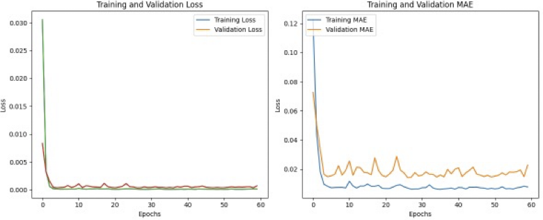
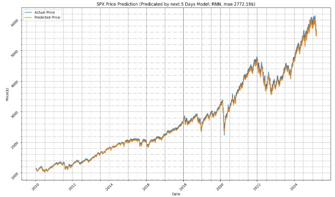

# Abtout
-	Finance stock market generates trading data every day. 
-	The project is considering leveraging a deep learning models (Sequence to Sequence Neural networks) to predict the stock price in the future days.
-	There could be multiple factors impacting the daily stock price, such as marco economics, subject motions etc. 

## data set
SPX historic data can be downloaded form yahoo finance. It has history data since year 1927. Considered the correlation of the economic environment, This project initialy picked up the daily price data between year 2010 and 3/20/2025.

  

## Consideration
-	Considered that stock trading happens every working day. The prices in the past days impacts the price next couple of days.
-	The project sets the time window by 5 days, which is leveraging the close price in the past 5 days to predict the prices in next 5 days in the future. Which clarified the project as a sequence to sequence prediction problem
-	Considering models, possible candidates are LSTM and RNN. the project impltemeented LSTM, RNN and stacked models. the result is following. 

# LTSM model
## model
 

## Loss & Metrics (MAE)
 

## validation
 

Compare the predicted price and the actual price. 
|Indicator|	Value	|Comment|
|---------|---------|-------|
|MAE|2772.1591441795117| Not good|
|MSE|9401551.0633827040| Too big|

# RNN
## Model

## Traing

## validation

|Indicator |Value|Comment|
|----------|-----|-------|
|MAE |2772.1780303868577| No improved|
|MSE |9401672.35340898 | Too big |

# Stacked 
# Model

# Traing

# Validation

|Indicator	|Value	|Comment|
|----------|-----|-------|
|MAE	|30.111811640584918	|improved|
|MSE	|1806.8682086366314	|Still big|

